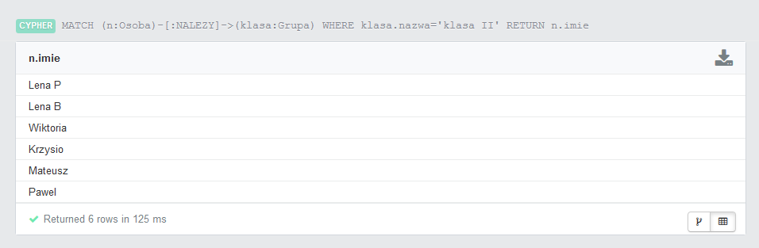
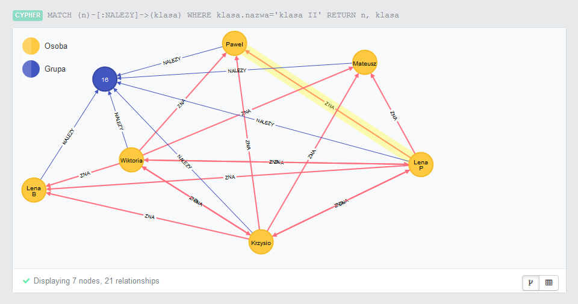
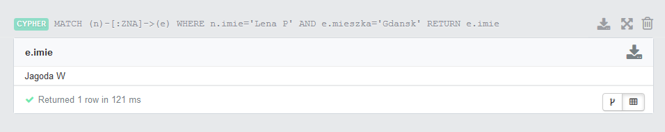
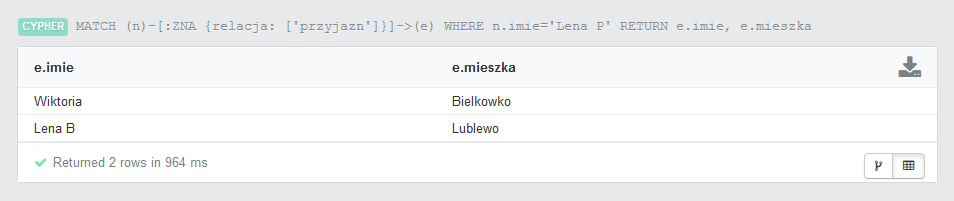

Neo4j
=====

Grafowa baza danych - Neo4j

Przedstawiam moją bazę danych. Jest to baza znajomych i przyjaciół moich córek. Obecnie wygląda tak:

Poniżej polecenia w języku CYPHER do tworzenia poszczególnych elementów bazy:

Osoby
-----
	CREATE (lenap:Osoba {imie: 'Lena P', rok_ur: 2006, mieszka: 'Bielkowko'})
	CREATE (dalia:Osoba {imie: 'Dalia', rok_ur: 2004, mieszka: 'Bielkowko'})
	CREATE (lenab:Osoba {imie: 'Lena B', rok_ur: 2006, mieszka: 'Lublewo'})

Grupy
-----
	CREATE (konie:Grupa {nazwa: 'konie', dzien: 'wtorek'})
	CREATE (basen:Grupa {nazwa: 'basen', dzien: 'czwartek'})
	CREATE (klasaII:Grupa {nazwa: 'klasa II'})

A teraz relacje:

relacja 1: ZNA
--------------
	CREATE
	(lenap)-[:ZNA {relacja:['przyjazn']}]->(lenab),
	(dalia)-[:ZNA {relacja:['kolezanka']}]->(jagodap),
	(lenap)-[:ZNA]->(pawel),

relacja 2: NALEZY (do jakiejś grupy)
------------------------------------
	CREATE
	(lenap)-[:NALEZY]->(konie),
	(pawel)-[:NALEZY]->(basen),
	(wiki)-[:NALEZY]->(klasaII)

Teraz kolej na wyszukiwanie informacji.

Pokaż znajomych Leny z klasy II:

	MATCH (n:Osoba)-[:NALEZY]->(klasa:Grupa) WHERE klasa.nazwa='klasa II' RETURN n.imie

Rezultat:

Można trochę inaczej:

A znajomi mieszkający w Gdańsku?

A gdzie mieszkają przyjaciele Leny?

