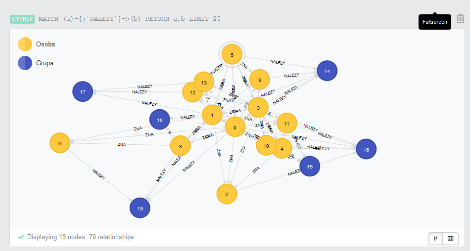

Neo4j
=====

Grafowa baza danych - Neo4j

Przedstawiam moją bazę danych. Jest to baza znajomych i przyjaciół moich córek. Obecnie wygląda tak:

Poniżej polecenia w języku CYPHER do tworzenia poszczególnych elementów bazy:

Osoby
=====
	CREATE (lenap:Osoba {imie: 'Lena P', rok_ur: 2006, mieszka: 'Bielkowko'})
	CREATE (dalia:Osoba {imie: 'Dalia', rok_ur: 2004, mieszka: 'Bielkowko'})
	CREATE (lenab:Osoba {imie: 'Lena B', rok_ur: 2006, mieszka: 'Lublewo'})

Grupy
=====
	CREATE (konie:Grupa {nazwa: 'konie', dzien: 'wtorek'})
	CREATE (basen:Grupa {nazwa: 'basen', dzien: 'czwartek'})
	CREATE (klasaII:Grupa {nazwa: 'klasa II'})

A teraz relacje:

